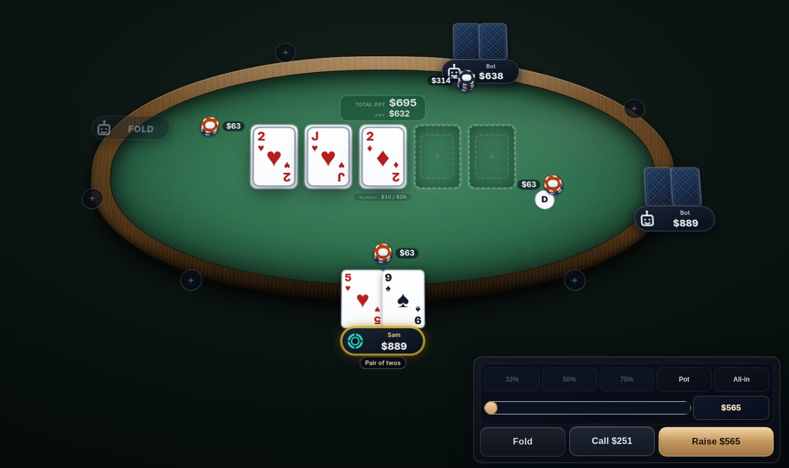
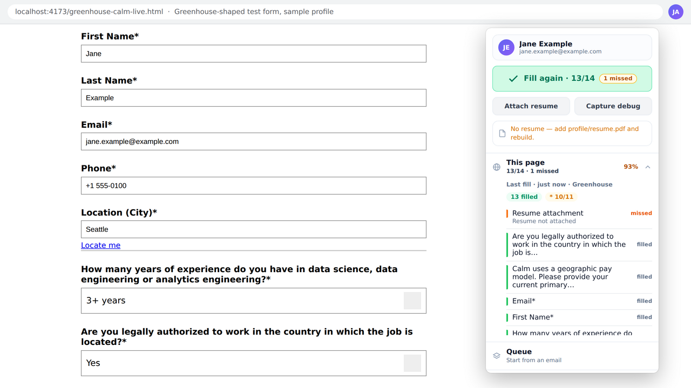
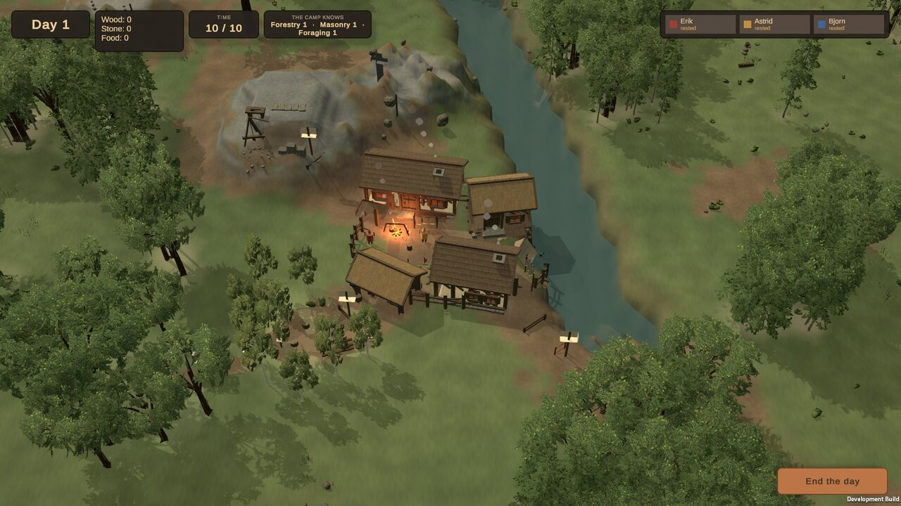
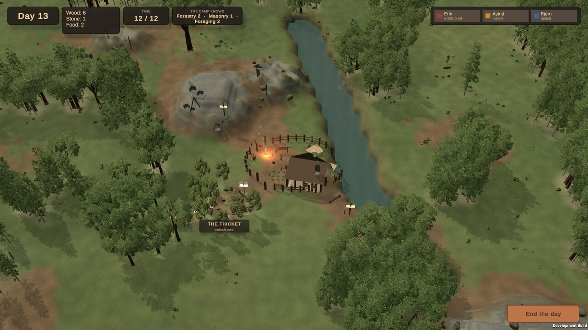
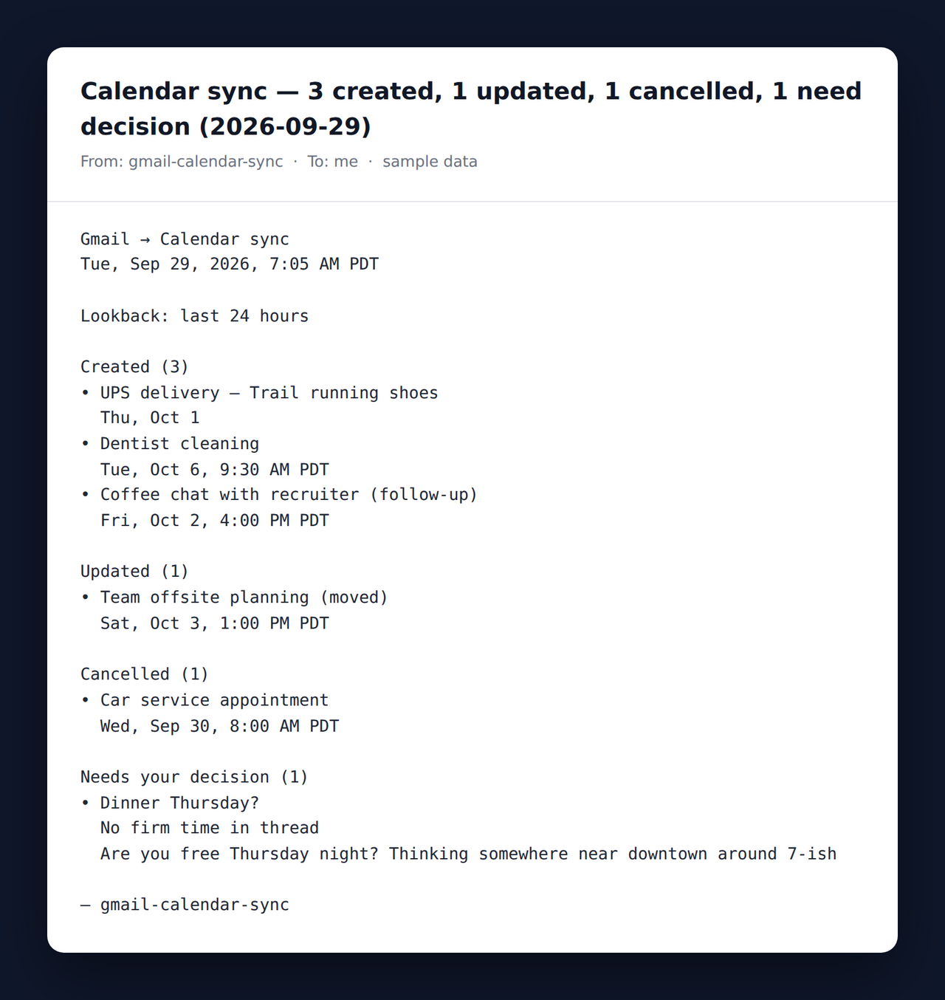
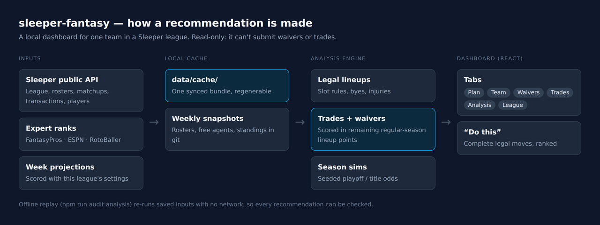
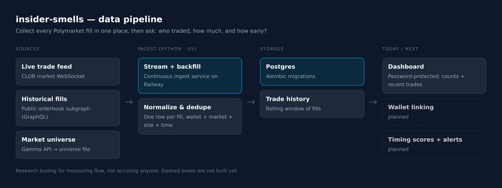
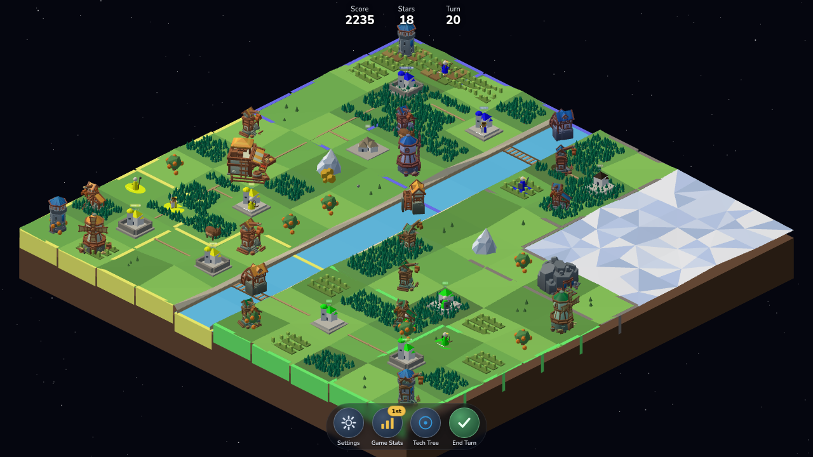
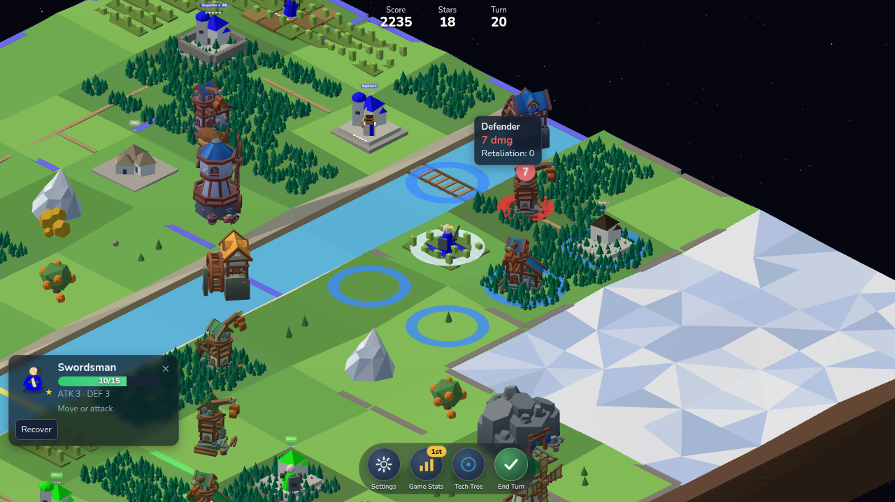

Welcome to my repo, almost everything is just vibecoded projects.

Most of what I build is private, so each project below has screenshots and a short tour to show what it does.

**Jump to:** [no-rake](#no-rake) · [job-autofill](#job-autofill) · [humble-beginnings](#humble-beginnings) · [gmail-calendar-sync](#gmail-calendar-sync) · [sleeper-fantasy](#sleeper-fantasy) · [insider-smells](#insider-smells) · [polytopia-plus](#polytopia-plus) · [sql-interview-prep](#sql-interview-prep)

---

## Private projects

### no-rake

Node · Fastify · WebSockets · React · Postgres · Railway &nbsp;|&nbsp; ~95% agent &nbsp;|&nbsp; <a href="https://no-rake-server-production.up.railway.app/">Play →</a>

Virtual Texas hold'em for friends and family, no real money. It started as "PokerNow, but with more features."

- Full no-limit hold'em from preflop to showdown, including side pots and all-in runouts
- Private rooms over WebSockets, host controls (adjust stacks, kick, move seats) and optional bots
- Every hand is saved: replay any hand street by street, see all-in EV, and export the ledger to CSV
- CI runs Playwright end-to-end tests on desktop, mobile Chrome, mobile Safari and tablet

Your turn on the flop, with the bet sizing panel open (captured against three bots)

---

### job-autofill

Chrome extension (Manifest V3) · TypeScript · esbuild · Playwright &nbsp;|&nbsp; ~95% agent

Fills job applications from a profile stored locally. It never submits anything; you review every field first.

- Matches fields on any page by label, placeholder, name and ARIA, then adds fixes for specific applicant tracking systems (Greenhouse, Ashby, iCIMS, Workday, Lever and others) where the generic match fails
- Handles the awkward inputs: custom dropdowns, comboboxes, split phone fields and demographic questions
- After each fill, a review panel lists what was filled, what was skipped and what it's unsure about
- Optional AI drafts for open-ended questions, always editable; there's no backend
- Tested against a library of saved application forms

A sample profile ("Jane Example") filling a test form built like a real Greenhouse application. 13 of 14 fields filled; the résumé shows as missed because none was loaded.

---

### humble-beginnings

Unity 6 · C# &nbsp;|&nbsp; ~95% agent

My first real game: a small camp grows into a settlement across a hand-built landmass, with roguelike combat as the second loop.

- Gather wood, stone and food, and build up skills like forestry, masonry and foraging, as a small camp of villagers grows into a settlement
- The camp grows visibly, from a single house and a fire to a cluster of longhouses by the river
- Now moving toward a living settlement where time runs continuously and villagers keep their own routines
- The world map lives in a text file (`map.json`) that syncs into the scene, so a hundred-odd hand-placed locations can be edited and reviewed like code
- A custom Unity menu and a small command bridge automate the busywork: building the world, scattering vegetation and capturing screenshots

<table>
<tr>
<td width="50%"></td>
<td width="50%"></td>
</tr>
<tr>
<td align="center">The camp after it has grown into a cluster of longhouses</td>
<td align="center">Day 13, zoomed out over the valley</td>
</tr>
</table>

From the in-progress build (September 2026)

---

### gmail-calendar-sync

Node · Gmail API · Google Calendar API · OpenAI &nbsp;|&nbsp; ~95% agent

Turns my inbox into calendar events every day, then emails me a summary of what changed.

- Handles calendar invites (ICS files), including updates and cancellations
- Picks up appointment emails that have no invite attached
- Package tracking: shipping emails become all-day delivery events that move when the ETA changes, using the live UPS tracking API
- An LLM reads personal and important threads and turns them into follow-ups and meetings, checking for an existing event first so nothing is added twice

The summary email, produced by the project's own formatter. The events are made-up sample data.

---

### sleeper-fantasy

React · TypeScript · Vite &nbsp;|&nbsp; ~95% agent

A local dashboard for my fantasy football team. It tells me which waiver claims and trades to make for my Sleeper league.

- Six tabs: Plan, Team, Waivers, Trades, Analysis and League
- Scores every trade and waiver claim by how many lineup points it adds over the rest of the regular season, using only legal lineups
- Averages expert rankings from FantasyPros, ESPN and RotoBaller, and runs seeded season simulations for playoff and title odds
- Read-only: it uses Sleeper's public API and can't submit anything. Saved inputs can be replayed offline to check any recommendation

---

### insider-smells

Python · uv · Postgres · Alembic · Railway &nbsp;|&nbsp; ~95% agent

Research tooling for Polymarket. The goal is to spot trading that looks coordinated or unusually well timed: who traded, how much, and how early.

- Streams live trades from Polymarket's market WebSocket and backfills historical fills from the public orderbook subgraph
- Stores everything in one Postgres database, removing duplicates, with versioned schema migrations
- A small password-protected dashboard confirms the data is flowing
- Next up: linking wallets, scoring timing and alerts. This is for research, not legal advice

---

### polytopia-plus

TypeScript · React · Three.js · Fastify · SQLite · Vitest &nbsp;|&nbsp; ~95% agent

A strategy game inspired by The Battle of Polytopia, for a private group of friends. It recreates the base game's rules and adds our own custom features.

- A rules engine that runs with no graphics and always gives the same result for the same moves, with content matched to the Steam v2.16.5 release
- Map generation, an invite-code lobby and online multiplayer where players take turns at their own pace, with the server deciding what's legal
- A 3D board built with Three.js, plus the tech tree, combat previews and a phone layout
- The current phase is visual polish: matching the original game's look, screenshot by screenshot

<table>
<tr>
<td width="50%"></td>
<td width="50%"></td>
</tr>
<tr>
<td align="center">The whole board on turn 20</td>
<td align="center">Previewing an attack: the defender would take 7 damage</td>
</tr>
</table>

---

## Public projects

### sql-interview-prep

DuckDB · Python &nbsp;|&nbsp; ~70% agent &nbsp;|&nbsp; <a href="https://github.com/chensam93/sql-interview-prep">View repo →</a>

Interview-style SQL questions backed by DuckDB sample data. You run queries against real rows instead of whiteboarding on paper.
